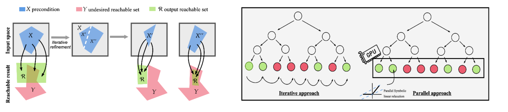

# Efficient #DNN-Verification via Parallel Symbolic Interval Propagation and Linear Relaxation

This is the Python implementation of ProVe+SLR, a tool for the #DNN-Verification Problem (i.e., the problem of computing the volume of all the areas that do (not) result in a violation for a given DNN and a safety property). ProVe+SLR is an exact approach that provides provable guarantees on the returned volume. This code is based on ProVe[A].


<div style="text-align:center;">
    
</div>


## Dependencies: 
    - Tensorflow
    - numpy
    - cupy
    - cmake

Project structure:
    - create_nnet.py: python script which can be used to create neural networks with different parameters (input size, output size, weights, ...) in h5 and nnet format

    - "symbolic" folder: multidimensional implementation of symbolic propagation in C. It is necessary to modify the hardcoded path in main_new.c to target a neural network in nnet format.
        In order to build and run this implementation, use the following commands from within the "symbolic/build" folder:
            - cmake ..
            - make
            - ./main

    - "cuda_integration" folder: monodimensional implementation of symbolic propagation in CUDA.
        cuda_code.py contains the monodimensional interval propagation CUDA code, while cuda_code_symbolic.py contains the monodimensional symbolic propagation CUDA code.
        test_propGPU.py targets a neural network using a hardcoded path and verifies a given property using either interval propagation or symbolic propagation with cupy.


## Contributors
*  **Gabriele Roncolato** - gabriele.roncolato@studenti.univr.it
*  **Luca Marzari** - luca.marzari@univr.it

## Reference
[1] [Formal verification of neural networks for safety-critical tasks in deep reinforcement learning](https://proceedings.mlr.press/v161/corsi21a.html) Corsi D., Marchesini E., and Farinelli A. UAI, 2021
    
If you use our verifier in your work, please kindly cite our paper:
[Scaling #DNN-Verification Tools with Efficient Bound Propagation and Parallel Computing](https://arxiv.org/pdf/2312.05890).  Marzari L., Roncolato G., and Farinelli A. AIRO, 2023
```
@incollection{marzari2023scaling,
  title={Scaling \#DNN-Verification Tools with Efficient Bound Propagation and Parallel Computing},
  author={Marzari, Luca and Roncolato, Gabriele and Farinelli, Alessandro},
  booktitle={AIRO 2023 Artificial Intelligence and Robotics 2023},
  year={2023}
}
```
